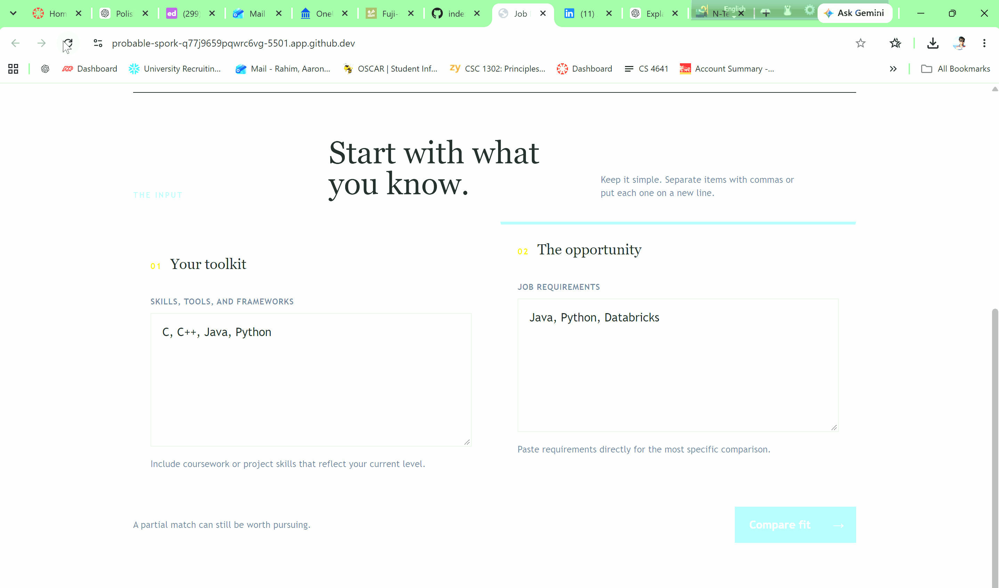
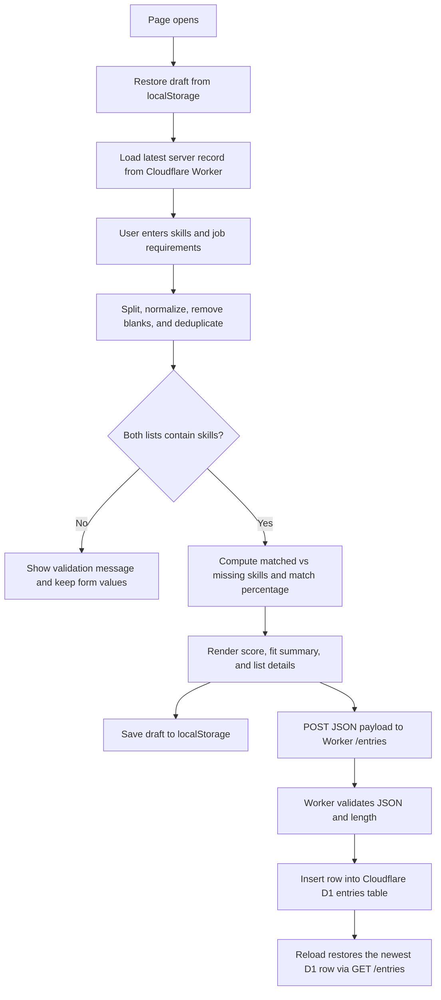

# Job Skill Comparison Application

<!-- Badges are optional but cheap. shields.io generates them from a URL. -->


## What

The Job Skill Comparison Application helps technical job seekers decide whether
 a role is worth pursuing by comparing their skills with a job's requirements. I
t reports a percentage alignment score, shows matched and missing skills, and pr
esents the result as a suggestion rather than a guarantee of an interview or job
 offer. See the project context in [PROJECT.md](context/PROJECT.md) and the feat
ure requirements in [FEATURES.md](context/FEATURES.md). As of 09/24/26, data is now stored in a Cloudflare D1 database rather than in the browser.

## See It Work

This screenshot shows the app meeting the empty-input EARS requirement: when eit
her list is empty after trimming and removing blanks, the page displays a valida
tion message and does not compute a match score. This behavior is verified in th
e acceptance checks and is described in the Explain, Change, Verify section at t
he bottom th page which describes the function which generates the percentage ma
tch.




This GIF demonstrates the persistence behavior: after entries are saved, the browser cache is cleared and the page is refreshed, yet the saved entries still remain. That confirms the entries survive a cleared cache and reload.

<!-- HTML gives you sizing control markdown does not: -->
<!--  -->

## How to Run

### Deployed Worker

The deployed Cloudflare Worker is available at:

```text
https://mgt3745-hw4.arahim.workers.dev
```

The bare root URL is the worker entry point, not the static app page. This project serves the interface through a separate frontend (for example, Live Server on port 5500), while the worker exposes its API at:

```text
https://mgt3745-hw4.arahim.workers.dev/entries
```

That `/entries` URL is the correct endpoint to check when confirming the deployed Worker is responding.

Open this repository in a GitHub Codespace. No local install is required.

1. On your repository page, click **Code → Codespaces → Create codespace on main
**. Wait for setup to finish; first-boot time varies.
2. Keep the supplied `.devcontainer/devcontainer.json`. It configures Live Serve
r installation and port 5500 forwarding. Once the extension is ready, right-clic
k `index.html` and choose **Open with Live Server**, or use **Go Live**.
3. If a browser tab does not open, use the **Ports** tab to open port 5500. Keep
 its visibility **Private**.
4. With Live Server running, save your edits to reload the page.

If Live Server is unavailable, run `node scripts/serve.mjs` in the terminal, the
n open port 5500 from the Ports tab. Refresh the browser after edits when using
this fallback; stop it with **Ctrl+C**. Run only one server on port 5500 at a ti
me. The fallback also works locally with Node 22 or later. Serve over HTTP rathe
r than opening `index.html` through `file://`.

### Run the Worker locally

The static page and the Cloudflare Worker use different local ports. Start the
Worker in a second terminal:

```bash
npx wrangler d1 execute mgt3745-entries --local --file=schema.sql
npx wrangler dev
```

Wrangler normally serves the Worker at `http://localhost:8787`. Test it with:

```bash
curl http://localhost:8787/entries
```

Keep the first command only for the initial local database setup, or after the
schema changes. Stop the Worker with **Ctrl+C**.

The current browser app uses the deployed Worker URL in `app.js`, so running
`wrangler dev` alone does not redirect the page's requests to localhost. To
exercise the page against the local Worker, temporarily change its `API`
constant to `http://localhost:8787`, run the page on port 5500, and restore the
deployed URL before committing or publishing the frontend.

<!-- The .devcontainer folder installs Live Server automatically. If the right-c
lick option
     is missing, wait for the extension to finish installing (bottom-left status
 bar), or run
     `python3 -m http.server 5500` in the terminal and open port 5500 from the P
orts tab.
     Edit these steps if your feature needs anything more. -->

## How It Works

<!-- GitHub renders Mermaid natively inside a ```mermaid fence. -->



The page keeps a local browser draft in `localStorage` so typed values survive a
refresh, but the real persistence path is the Cloudflare Worker and D1 database.
When the user evaluates a match, the browser sends a JSON payload like
`{"userSkills": "...", "jobText": "..."}` to the Worker at `/entries`. The
Worker validates the request, rejects oversized entries over 2,000 characters
with a 400 response, and inserts the raw text into the D1 table using the bound
`env.DB` connection. On the next load, the app first restores the in-browser
state and then falls back to the latest row returned by `GET /entries`, which is
why a saved entry still appears after the browser cache is cleared.

The comparison logic itself still reads the user and job lists, normalizes common
aliases, ignores blank and duplicate entries, and calculates the percentage match
before rendering matched and missing skills and the fit summary.

## Status

| Area | State | Why |
|------|-------|-----|
| Comparison, validation, and display | Works | The implemented flow calculates the match percentage, shows matched and missing skills, and handles empty inputs. |
| Draft and server persistence | Works | Browser drafts use localStorage, and valid comparisons are saved through the deployed Worker and D1 database. |
| Storage failure handling | Deferred | The app preserves typed values when a browser save fails, but there is no broader recovery or retry workflow. |
| Multi-user sync and concurrency | Deferred | Shared D1 storage is available, but the app does not define conflict handling or coordination between clients. |
| Network and server-error simulation | Deferred | The Worker has error responses, but controlled outage and 500-path verification are not part of the current local workflow. |


<details>
<summary>Verification results (click to expand)</summary>

The automated suite passed all 8 EARS tests, covering comparison percentages,
empty-input validation, fit thresholds, matched and missing list rendering,
normalization, and reload persistence. The complete evidence and procedures are in
the [full verification results](context/FEATURES.md#verification). Storage-failure
handling is not implemented.

</details>

## Links

Read in this order:

1. [`context/PROJECT.md`](context/PROJECT.md): the problem and its framing
2. [`context/USERS.md`](context/USERS.md): who this is for
3. [`context/FEATURES.md`](context/FEATURES.md): what it must do, and verificati
on results
4. [`context/ARCHITECTURE.md`](context/ARCHITECTURE.md): the gate and ADR-001
5. [`context/STANDARDS.md`](context/STANDARDS.md): the rules this code follows
6. [`context/CLAUDE.md`](context/CLAUDE.md): the same rules, for agents
7. [`context/TOOLS.md`](context/TOOLS.md): tools, deployment, and accountability
8. [`context/STYLE.md`](context/STYLE.md): visual and interaction standards
9. [`index.html`](index.html): the page structure and form controls
10. [`styles.css`](styles.css): the page styling and layout
11. [`app.js`](app.js): comparison, validation, rendering, and storage logic
12. [`app.test.js`](app.test.js): updated unit tests used for HW3 verification
13. [`docs/SESSION_B_COMMANDS.md`](docs/SESSION_B_COMMANDS.md): deployment and local testing commands
The scaffold also includes [SKILLS.md](context/SKILLS.md),
[EVALS.md](context/EVALS.md), and [AGENTS.md](context/AGENTS.md). Verification
stays in FEATURES.md until EVALS.md activates in Module 5.

The root README.md and context files are the project documentation for this
submission. The `docs` folder contains the provided HW4 deployment guidance.

## AI Use (Check HW4 under the HW 3)

<!-- A Delegation Decision Record without the name. From HW5 this becomes a form
al DDR. -->

**Tool and task delegated:** Creation of app.js and associated unit tests to cover EARS evidence, index.html, styles.css, and generation of parts of README.md and CLAUDE.md. For other files it was used to polish writing after my drafts.

**Why:** Creating the app by hand and testing it would have taken a lot of time (estimating a month). Generating the How it works and what it does sections of the README makes sense since AI could use app.js, index.html, styles.css, and context files to draft the information quickly.

**How it was checked:** I manually checked the actual worker behavior, confirmed the root URL returns 404 while `/entries` responds correctly, and compared that against the documentation. I also reviewed the generated text and corrected wording where it was unclear or misleading.

**Observed result / evidence:** The change history records the following feature
 work and checks:

- [Verification results](context/FEATURES.md#verification).
- [Validation message styling](styles.css) was checked with the empty-input EARS
 test and manual visual review; commit `2aaca8f5e1c87582b1a9f2192e602c61e8d93e57
` records the increase in message size.
- [Prefilled input removal](index.html) was manually checked by confirming both
fields open blank; commit `a964338c9c967bd91fea72a4bbff6ebf5f451067` records the
 removal.
- [No skill match despite 100% display fix](https://github.com/aaronsarasota04/m
gt3745-hw3/commit/9d3f2e24f8877f557100ac5fbced39801850e113) was checked by the e
xact-match EARS test.
- [LinkedIn link removal](https://github.com/aaronsarasota04/mgt3745-hw3/commit/
2f78fff6e6fbebf672bb16df2d56da04018ebe40) and [role profile removal](https://git
hub.com/aaronsarasota04/mgt3745-hw3/commit/6878148e9c2a01342d2225e96fbe80a71584a
5a9) were manually reviewed as scope reductions; the current unit suite checks t
hat the remaining comparison workflow still passes.

**Instruction discovery and compliance:** Github Copilot. It read instructions f
rom CLAUDE.md. All standards in CLAUDE.md has been ensured it is present in the
code


**Actual hours on this assignment (optional):** 6

### HW 4:

**Tool and task delegated:** I used AI to debug `worker.js` and confirm that the HTTP 400 path worked as intended, update `TOOLS.md` with the tools used, bring the HW3 files into the HW4 project, update the HW3 `app.test.js` unit tests used for verification so they worked with the Worker-backed app, and proofread my drafts in the other Markdown files to polish the writing."How to Run the Worker Locally" section was generated with AI assistance, but then verified and corrected by me before submission.

**Why:** I delegated these tasks to save time, reduce the risk of errors while moving files manually, and avoid additional debugging problems because I am still becoming familiar with front-end development.

**How it was checked:** I ran the updated `app.test.js` unit tests used for HW3 verification and confirmed that all eight comparison and persistence tests passed with the HW4 fetch-backed app. For the Worker, Copilot wrote the `fieldTooLong` variable. It first parses `body.text` as JSON and then checks whether the `userSkills` or `jobText` fields are longer than 2,000 characters; if parsing fails, it falls back to checking the raw text length. I could not fully verify every possible JSON shape or malformed payload branch, so I reviewed that logic and asked Copilot to test an entry over 2,000 characters. I then manually pasted a 2,000-character entry into the website and confirmed that the deployed Worker returned HTTP 400 and the page displayed the expected validation message. I also checked that the transferred HW3 files and polished Markdown still reflected my original work and requirements. For running the worker locally, I manually did the steps it gave me to verify output.

**Actual hours on this assignment:** 7

## Explain, Change, Verify

[Identify one function and explain its input, state changes, and output in your
own words. Link a meaningful before/after code change, state its expected effect
, and record the observed behavior and evidence. Explain why the change matters
to your selected requirement. This paragraph is part of the existing README subm
ission.]

The function evaluateMatch does not take in any input. It extracts the skills in
put by the user for themselves and for the job they are trying to compare it wit
h into two lists (these are saved as constants) . If any of these lists are null
, then it prints a validation message, depending on which list is null. It then
filters out matched skills, missing skills, and calculates a percentage of skill
s matched. If the percentage is more than 75%, a message saying it is a strong f
it is recorded; if it is between 50 and 75%, it is a partial fit, otherwise it i
s a weak fit. All of these constants are then output to show on the webpage. Thi
s function is crucial to the webpage, since it handles the main logic on how two
 lists are converted to a percentage the user can then use to decide whether to
pursue that job or not.

### Before and after the code change

Before the change, the app did not do anything once Compare fit is clicked. The
logic when this is clicked is controlled by evaluateMatch which can be seen in t
he second photo below. 


<!-- Things this README could also do, if they earn their place:
     - GitHub alerts:  > [!NOTE]  > [!WARNING]  > [!TIP]
     - Task lists:     - [x] done   - [ ] not yet
     - Emoji:          :rocket: :white_check_mark:
     - Footnotes:      text[^1]  ...  [^1]: the note
     - Embedded HTML tables, <kbd>Ctrl</kbd>+<kbd>S</kbd>, <sup>, <sub>
     None are required. A README that reads well with none of them beats one tha
t uses all of them. -->
